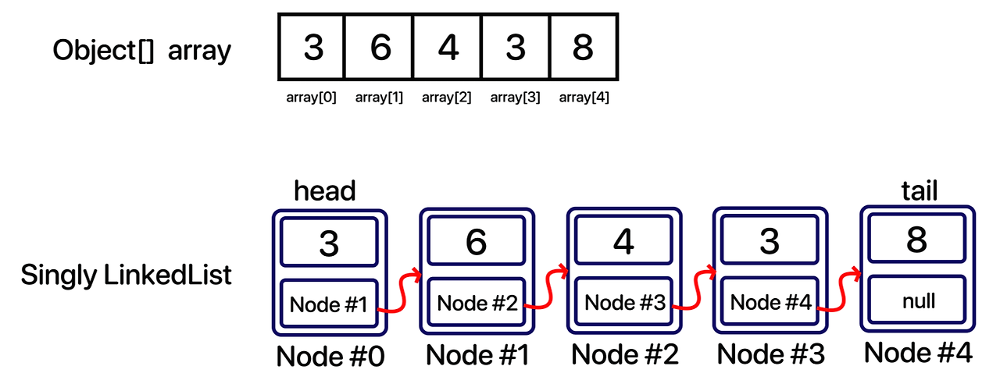

#### 배열(`int[], double[]`) vs. List 인터페이스에서 지원하는 클래스들(ex. `ArrayList`, `LinkedList` . . .)  

**[공통점]**  
1. 동일한 특성의 데이터들을 묶는다.
2. 반복문(loop)내에 변수를 이용하여 하나의 묶음 데이터들에 모두 접근할 수 있다.

---

**[차이점-배열]**
1. 처음 선언한 배열의 크기(길이)는 변경될 수 없다. 이를 정적 할당(static allocation)이라고 한다.
2. 메모리에 연속적으로 나열되어 할당된다.
3. index 에 위치한 하나의 데이터(element)를 삭제하더라도 해당 index 에는 빈공간으로 계속 남는다.

**[차이점-리스트]**
1. 리스트의 길이가 가변적이다.
2. 데이터들이 연속적으로 나열된다. (메모리에 연속적으로 나열되지 않고 각 데이터들은 주소(reference)로 연결되어있다.)
3. 데이터(element) 사이의 빈 공간을 허용하지 않는다.

---

**[배열의 장점]**
1. 데이터 크기가 정해져있을 경우, 메모리 관리가 편하다.
2. 메모리에 연속적으로 나열되어 할당하기 때문에 index 를 통한 색인(접근)속도가 빠르다.

**[배열의 단점]**
1. 배열의 크기를 변경할 수 없기 때문에 초기에 너무 큰 크기로 설정해주었을 경우 메모리 낭비가 심해지고, 반대로 너무 작은 크기로 설정해주었을 경우 데이터를 다 담을 수 없는 경우가 발생할 수 있다.
2. 데이터를 삽입, 삭제를 할 때, 빈 공간을 허용하지 않고자 한다면, 뒤의 데이터들을 모두 밀어내거나 당겨주어야 하기 때문에 속도가 느려 삽입, 삭제가 빈번한 경우에는 유용하지 않다.

---

**[리스트의 장점]**
1. 데이터의 개수에 따라 해당 개수만큼 메모리를 동적 할당해주기 때문에 메모리 관리가 편리해진다.
2. 빈 공간을 허용하지 않기 때문에 데이터 관리에도 편하다.
3. 포인터(주소)로 각 데이터들이 연결되어 있기 때문에 해당 데이터에 연결된 주소만 바꿔주면 되기 때문에 삽입 삭제에 용이하다. (ArrayList는 예외)

**[리스트의 단점]**
1. 객체로 데이터를 다루기 때문에 적은양의 데이터만 쓸 경우 배열에 비해 차지하는 메모리가 커진다.  
간단히 예로들어 primitive type 인 Int 는 4Byte 만 차지한다. 반면에 Wrapper class 인 Integer 는 32bit JVM 에선 객체의 헤더(8Byte), 원시 필드(4Byte), 패딩(4Byte)으로 최소 '16Byte 를 차지한다.' 
거기에다가 이러한 객체데이터들을 다시 주소로 연결하기 때문에 16 + a 가 된다.
2. 기본적으로 주소를 기반으로 구성되어 있고 메모리에 순차적으로 할당하는 것이 아니기 때문에 (메모리 주소상 순차적이지 않다.) 색인(검색)능력은 떨어진다.

---

#### ArrayList
ArrayList 는 다른 자료구조와 달리 Object[] 배열(객체 배열)을 두고 사용한다.  
또한 모든 자료구조는 '동적 할당'을 전제로 한다. 동적 할당을 안하고 사이즈를 정해놓고 구현한다면 메인함수에서 정적배열을 선언하는 것과 차이가 없다.  

데이터의 개수를 알 수 없는데 배열을 쓰고 싶을 때 우리는 List 인터페이스를 구현한 자료구조를 사용할 것이다.  
왜냐면 사이즈를 정하지 않고 동적으로 활용할 수 있기 때문이다.  
마지막으로 리스트 계열 자료구조는 **데이터 사이에 빈 공간을 허락하지 않는다.**

---

#### Singly LinkedList
LinkedList 와 ArrayList 와 가장 큰 차이점이라 한다면 바로 '노드'라는 객체를 이용하여 연결한다는 것이다.
ArrayList 의 경우 최상위 타입인 오브젝트 배열(Object[])을 사용하여 데이터를 담아두었다면, LinkedList 는 배열을 이용하는 것이 아닌
하나의 객체를 두고 그 안에 데이터와 다른 노드를 가르키는 레퍼런스 데이터로 구성하여 여러 노드를 하나의 체인처럼 연결하는 것이다.

#### Doubly LinkedList
Singly LinkedList 와 비교해서, '이전 노드'를 가르키는 변수가 추가된다.

이렇게 양방향으로 연결되면 무엇이 좋은가? => Singly LinkedList 에 비해 검색(색인) 능력이 좋아진다.  
단방향으로 연결 된 Singly LinkedList 의 경우, 반드시 head 부터 시작하여 탐색하여다. 
하지만, Doubly LinkedList 의 경우, 찾으려는 노드가 tail에 가깝다면 tail 부터, head 에 가깝다면 head 부터 탐색하면 되기 때문에
좀 더 효율적인 탐색이 가능하다.