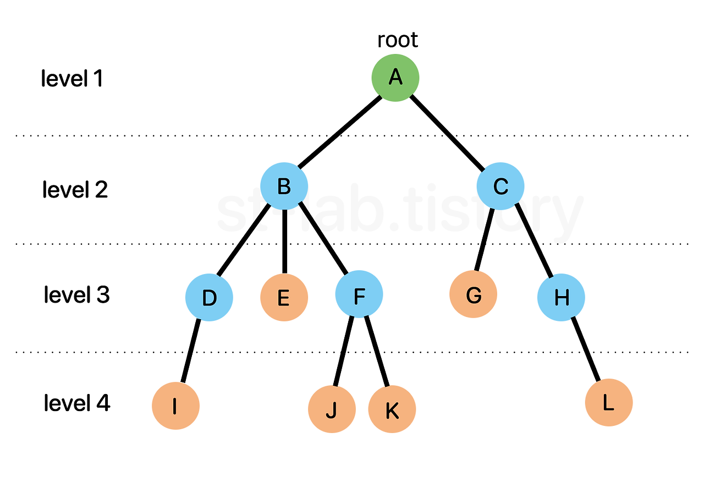
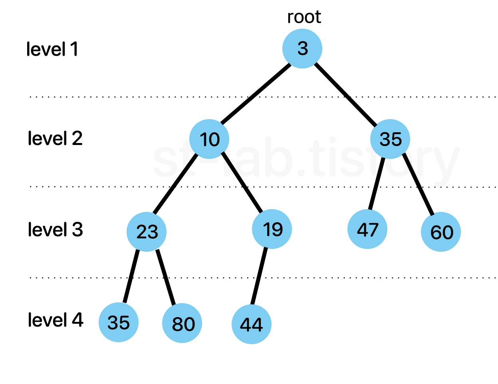

Queue 는 '대기열' 즉, '선입선출(FIFO : First In First Out)' 자료구조다. 먼저 들어온 놈이
먼저 나가는 것.  
그렇다면, 큐를 어디에 활용할 수 있을까?  
쉽게 생각하면 시간 순으로 어떤 작업 또는 데이터를 처리할 필요가 있는 것들은 큐의 성질을 갖고 있다고 보면 된다.
또한 대표적으로 알고리즘에서는 BFS(너비 우선 탐색)에 사용된다.

#### LinkedListQueue
자바에서는 큐의 경우 LinkedList 로 구현한 큐가 쓰이는 만큼 가장 대중적이고, 배열로 구현하는 큐에 비해 쉽다.  
이유가 뭔가하면 배열로 구현한 큐의 경우 내부에서 Object[] 배열로 담고 있고, 요소가 배열에 들어있는 양에 따라
용적(배열 크기)을 줄이거나 늘려주어야 하고, 큐를 선형적인 큐로 구현했을 경우 요소들이 뒤로 쏠리기 때문에
이러한 문제를 효율적으로 극복하고자 원형 형태로 구현하는데 이 구현이 고려해야 할 점도 많고 조금 복잡하다.

하지만 배열 대신 연결리스트로 구현하게 될 경우 위와같은 단점들이 해결된다. 각 데이터들을 노드(node) 객체에 담고
노드 간 서로 연결해주기 때문에 배열처럼 요소 개수에 따라 늘려주거나 줄여줄 필요도 없고 삽입, 삭제 때는 연결된 링크만 끊어주거나
이어주면 되기 때문에 관리면에서도 편하다.

#### Deque
왜 Deque(덱)일까? Deque는 **Double-ended queue** 의 줄임말이다.  
큐는 단방향 자료구조다. 단방향 연결리스트(Singly LinkedList)와 유사한 메커니즘이다.  
반대로 Deque 는 양방향 연결리스트(Doubly LinkedList)와 유사한 메커니즘이다. 
앞서 말한 double-ended, 두 개의 종료 지점이 있다는 것. 한 마디로 단 방향으로 삽입 삭제가 이루어진 것에서
양쪽 방향으로 삽입 삭제가 이루어질 수 있도록 구현 한 것이 Deque 다.

양방향 큐. 즉 덱의 장점이라 하면 **스택처럼 사용할 수도 있고 큐 처럼 사용할 수도 있는 자료구조**다.

아무래도 Deque 의 경우 양 방향이다보니, 메소드들이 헷갈릴 수 있는데 다음 큐와 비교한 그림을 보면서 덱의 구조와
기본적인 메소드의 매칭을 잘 알아두도록 하자.

#### Heap
힙은 '**최솟값 또는 최댓값을 빠르게 찾아내기 위해 완전이진트리 형태로 만들어진 자료구조**'다.  

위와같은 구조를 Tree 구조라고 한다.

**부모 노드(parent node)** : 자기 자신(노드)과 연결된 노드 중 자신보다 높은 노드를 의미.  
**자식 노드(child node)** : 자기 자신(노드)과 연결된 노드 중 자신보다 낮은 노드를 의미.
**루트 노드(root node)** : 일명 뿌리 노드라고 하며 루트 노드는 하나의 트리에선 하나밖에 존재하지 않고, 부모노드가 없다.  
**단말 노드(leaf node)** : 리프 노드라고 불리며 자식 노드가 없는 노드를 의미한다.  
**내부 노드(internal node)** : 단말 노드가 아닌 노드  
**형제 노드(sibling node)** : 부모가 같은 노드  
**깊이(depth)** : 특정 노드에 도달하기 위해 거쳐가야 하는 '간선의 개수'  
**레벨(level)** : 특정 깊이에 있는 노드들의 집합을 말하며, 구현하는 사람에 따라 0 또는 1부터 시작  
**차수(degree)** : 특정 노드가 하위(자식) 노드와 연결된 개수 (ex. B의 차수 = 3)

그리고 위 트리 구조에서 특정한 형태로 제한을 하게 되는데, 모든 노드의 최대 차수를 2로 제한한 것이다.  
이를 '**이진 트리(Binary Tree)**'라고 한다.
그럼 이제 마지막으로 '완전 이진 트리(complete binary tree)' 에서 '완전'이라는 것은 무엇인지 알아보아야 한다.  
'완전 이진 트리'란 먼저 정의하자면 '마지막 레벨'을 제외한 모든 노드가 채워져있으면서 모든 노드(= 사실상 마지막 레벨의 노드들)가
왼쪽부터 채워져있어야 한다.

즉, 완전 이진 트리는 이진 트리에서 두 가지 조건을 더 만족해야 하는 것이다.
1. 마지막 레벨을 제외한 모든 노드가 채워져있어야 함.
2. 모든 노드들은 왼쪽부터 채워져있어야 함.

따라서 힙의 모습은 다음과 같다.
