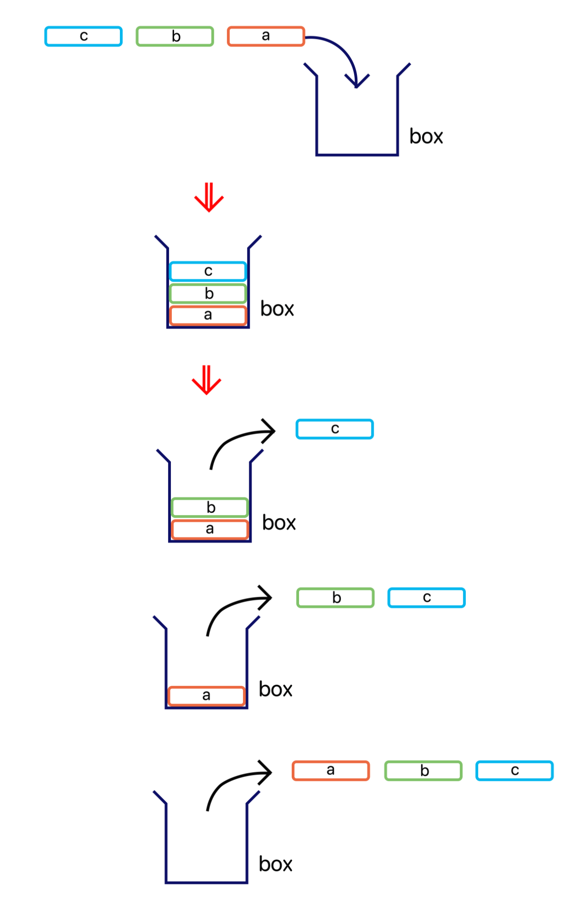
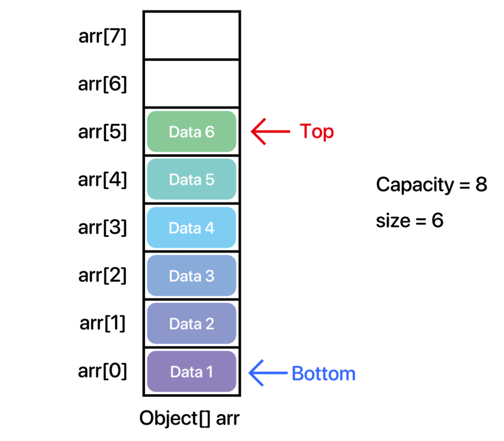

기본적으로 Stack 클래스는 내부에서 최상위 타입 배열인 **Object[] 배열을 사용하여 데이터들을 관리**하고 있다.  
스택은 기본 원칙이 '후출선입(LIFO : Last In, First Out)'이다. 즉, 나중에 들어온 것이 먼저 나가는 방식이다.  

이러한 구조는 보통 '뒤로 가기', '실행 취소', 그리고 컴퓨터 구조에서 'stack memory'가 대표적이다.  
스택의 장점은 후출선입인 만큼 직전의 데이터를 빠르게 갖고올 수 있다는 것이다. 또한 균형성 검사를 할 수 있기 때문에 수식, 괄호등의 검사에서도 쓰인다.

**Bottom** : 가장 밑에 있는 데이터 또는 그 데이터의 인덱스를 의미한다.  
**Top** : 가장 위에 있는 데이터 또는 그 데이터의 인덱스를 의미한다.  
**Capacity** : 데이터를 담기 위한 용적.  
**size** : 데이터의 개수  

그리고 **데이터를 추가하는 작업**을 **push** 라고 한다. (리스트에서의 add 같은 역할)  
또한 **데이터를 삭제하는 작업**을 **pop** 이라고 한다. (리스트에서의 remove 와 같은 역할)

모든 자료구조는 '**동적 할당**'을 전제로 한다. 가끔 ArrayList, Stack 같이 Object[] 배열을 사용하는 자료구조를 구현 할 때,
자료구조의 용적(Capacity)이 꽉 차면 리스트의 크기를 늘리지 않고 그냥 꽉 찼다고 더이상 원소를 안받도록 구현한 경우가 많은데
이는 자료구조를 구현하는 의미가 없다.  

동적 할당을 안하고, 사이즈를 정해놓고 구현한다면 메인함수에서 정적배열을 선언하는 것과 차이가 없다.
